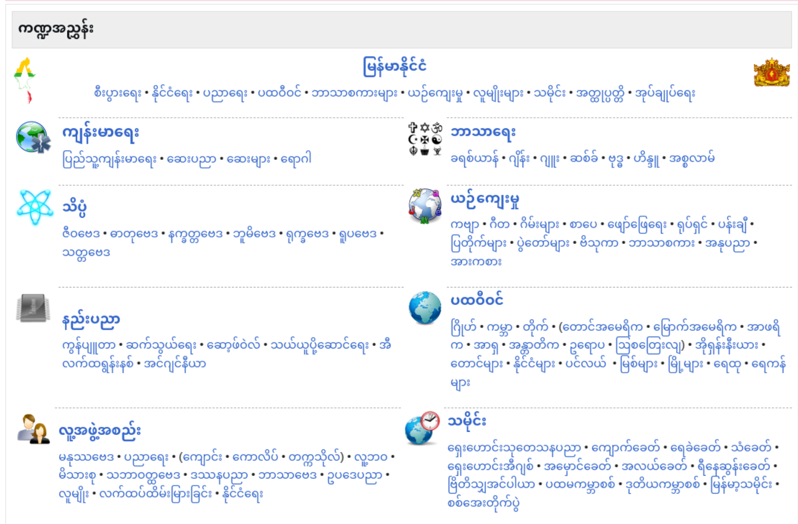

# Myanmar Wikipedia Dataset (Last Crawl Date: 25/03/2025)

A collection of scraped Myanmar Wikipedia pages organized by category paths.

## Overview

This dataset contains Myanmar Wikipedia articles scraped based on categorical organization. Unlike the official [Wikimedia dataset](https://huggingface.co/datasets/wikimedia/wikipedia) (subset: 20231101.my), this repository provides an alternative approach to Myanmar Wikipedia content by following the categorical structure starting from the [main entry page](https://my.wikipedia.org/wiki/%E1%80%97%E1%80%9F%E1%80%AD%E1%80%AF%E1%80%85%E1%80%AC%E1%80%99%E1%80%BB%E1%80%80%E1%80%BA%E1%80%94%E1%80%BE%E1%80%AC).

*Figure 1: The initial category page showing both direct article links and category links*

## Dataset Structure

### Columns

| Column | Description |
|--------|-------------|
| `title` | Title of the Wikipedia article |
| `content` | Full text content of the article |
| `categories` | All category tags associated with the article (as returned by the API) |
| `url` | Unique URL of the Wikipedia article |
| `last_modified` | Timestamp of when the article was last modified |
| `category_path` | Complete hierarchical path of categories leading to the article |
| `category_path_count` | Number of category paths for the article |

## Data Organization Methodology

This dataset was created with a focus on comprehensive categorical coverage while minimizing redundancy:

- Articles are crawled following different category paths
- To reduce duplication, identical categories under different paths are excluded
    - Example: If articles (page-1, page-2, page-3) are found under both:
        - `category_path_1`: category-a > category-b > category-c
        - `category_path_2`: category-d > category-e > category-c
    - The second path is excluded to prevent duplication

- However, identical articles found under different category names are included:
    - Example: If articles (page-1, page-2, page-3) can be found under both:
        - `category_path_1`: category-a > category-b > category-c
        - `category_path_2`: category-a > category-e > category-f
    - Both paths are included since they represent different categorical organizations

## Use Cases

This dataset is particularly useful for:

- Research on Myanmar language NLP tasks
- Building Myanmar-language models that benefit from categorical understanding
- Topic modeling of Myanmar-language content

## License

This dataset is free to use for any purpose - personal, commercial, or educational.

## Contributions

Feel free to create a pull request if you find any errors or have improvements to suggest for the dataset. Contributions to enhance the accuracy and completeness of the data are welcome.

## Acknowledgments

Special thanks to the Wikipedia contributors who created and maintain the original Myanmar Wikipedia content that made this dataset possible.